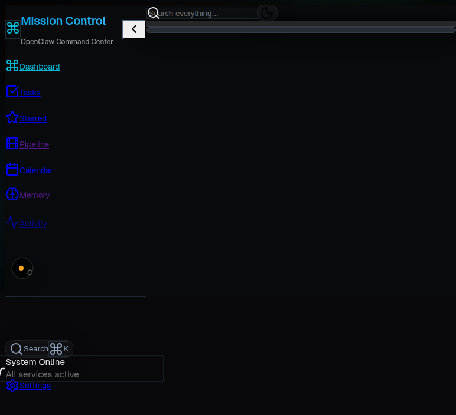

# 🎯 Mission Control

[](https://github.com/samjamliaison/mission-control/blob/master/LICENSE)
[](https://nextjs.org/)
[](https://www.typescriptlang.org/)
[](https://openclaw.com/)

**Advanced Command Center Dashboard for OpenClaw Operations**

Mission Control is a comprehensive web dashboard that provides real-time monitoring, task management, and operational control for OpenClaw AI agent environments. Built with Next.js and designed for teams who need professional-grade agent orchestration and project management.

Transform your OpenClaw workspace into a powerful command center with real-time agent status, dynamic task boards, team coordination, and seamless workflow automation.

## 📸 Screenshots

### Main Dashboard

*Real-time agent monitoring and system overview*

### Task Management
  
*Dynamic Kanban boards with drag-and-drop functionality*

### Agent Monitoring

*Live agent status and performance metrics*

### Calendar & Scheduling

*Integrated scheduling and event management*

### Knowledge Base

*Centralized knowledge base with search and tagging*

*Additional screenshots coming soon - browser control temporarily unavailable*

## ✨ Features

- 🤖 **Real-time Agent Monitoring** — Live status tracking of all OpenClaw agents
- 📋 **Dynamic Task Management** — Kanban boards with drag-and-drop functionality
- 👥 **Team Collaboration** — Agent assignments and workload distribution  
- 📅 **Integrated Calendar** — Event scheduling and timeline management
- 🧠 **Memory System** — Centralized knowledge base with search and tagging
- 📊 **Analytics Dashboard** — Performance metrics and activity insights
- 🔄 **Cron Job Management** — Schedule and monitor automated tasks
- 📱 **Responsive Design** — Works on desktop, tablet, and mobile
- 🌙 **Dark Mode** — Professional interface optimized for extended use
- 💾 **Offline Capable** — Local storage with API sync when available
- 🔧 **Environment Flexible** — Configurable paths for any OpenClaw setup
- 🚀 **One-Click Setup** — Automated onboarding wizard

## 🚀 Quick Start

### Option 1: One-Command Setup (Recommended)
```bash
npx mission-control-setup
```
This will clone, install, configure, and start Mission Control automatically.

### Option 2: Manual Installation  
```bash
# Clone the repository
git clone https://github.com/samjamliaison/mission-control.git
cd mission-control

# Install dependencies  
npm install

# Start development server
npm run dev
```

Visit `http://localhost:3000` and the setup wizard will guide you through configuration.

## ⚙️ Environment Setup

Mission Control automatically detects your OpenClaw environment on first run. If you need to configure manually:

### 1. Copy Environment Template
```bash
cp .env.local.example .env.local
```

### 2. Configure Paths
```env
# OpenClaw Integration
OPENCLAW_WORKSPACE=/path/to/your/openclaw/workspace
OPENCLAW_CONFIG=/path/to/your/openclaw.json

# Data Directory  
DATA_DIR=./data

# Application URL
NEXT_PUBLIC_APP_URL=http://localhost:3000
```

### 3. Verify OpenClaw Paths
Ensure your OpenClaw workspace and config file exist at the specified paths. Mission Control will validate these during setup.

## 🐳 Docker Deployment

### Quick Deploy with Docker Compose
```bash
# Clone and deploy
git clone https://github.com/samjamliaison/mission-control.git
cd mission-control
docker-compose up -d
```

### Manual Docker Build
```bash
# Build image
docker build -t mission-control .

# Run container
docker run -d \
  -p 3000:3000 \
  -e OPENCLAW_WORKSPACE=/path/to/workspace \
  -e OPENCLAW_CONFIG=/path/to/config.json \
  -v /your/openclaw/workspace:/app/workspace \
  mission-control
```

The application will be available at `http://localhost:3000`.

## 📚 API Documentation

Mission Control provides a comprehensive REST API for integration and automation:

### Agent Management
- `GET /api/agents` — List all agents with status and metadata
- `GET /api/agents/status` — Real-time agent status summary  
- `GET /api/agents/[id]/files` — Agent workspace file browser

### Task Management  
- `GET /api/tasks` — List all tasks with filtering options
- `POST /api/tasks` — Create new task
- `PUT /api/tasks/[id]` — Update existing task
- `DELETE /api/tasks/[id]` — Delete task

### Session Monitoring
- `GET /api/sessions` — Active session information
- `GET /api/sessions/[id]` — Detailed session data

### Memory System
- `GET /api/memory` — List memory entries (daily and long-term)
- `POST /api/memory` — Create new memory entry

### Calendar & Events
- `GET /api/calendar` — List calendar events
- `POST /api/calendar` — Create new event
- `PUT /api/calendar/[id]` — Update event
- `DELETE /api/calendar/[id]` — Delete event

### Automation
- `GET /api/cron` — List scheduled jobs
- `POST /api/cron` — Create cron job  
- `PUT /api/cron/[id]` — Update job
- `DELETE /api/cron/[id]` — Delete job

### System
- `GET /api/health` — Application health check
- `GET /api/setup-status` — Environment configuration status
- `POST /api/setup` — Initialize environment configuration

All endpoints return JSON and support standard HTTP status codes. Rate limiting and authentication depend on your OpenClaw configuration.

## 🛠️ Contributing

We welcome contributions! Here's how to get started:

### Development Setup
1. Fork the repository
2. Clone your fork: `git clone https://github.com/your-username/mission-control.git`
3. Install dependencies: `npm install`  
4. Create a branch: `git checkout -b feature/your-feature`
5. Make your changes and test thoroughly
6. Commit: `git commit -m "Add your feature"`
7. Push: `git push origin feature/your-feature`
8. Open a Pull Request

### Code Guidelines
- **TypeScript** — All new code must be typed
- **Testing** — Add tests for new features (`npm run test`)
- **Linting** — Code must pass ESLint (`npm run lint`)
- **Formatting** — Use Prettier (`npm run format`)
- **Responsive** — Ensure mobile compatibility
- **Accessibility** — Follow WCAG guidelines

### Issue Reporting
- Use clear, descriptive titles
- Provide reproduction steps
- Include environment details (OS, Node version, etc.)
- Add screenshots for UI issues

## 🔗 Links

- **GitHub**: [samjamliaison/mission-control](https://github.com/samjamliaison/mission-control)
- **Issues**: [Report bugs or request features](https://github.com/samjamliaison/mission-control/issues)
- **OpenClaw**: [Learn about OpenClaw](https://openclaw.com/)

## 📄 License

MIT License - see [LICENSE](LICENSE) file for details.

---

**Built for the OpenClaw community** • **Made with Next.js & TypeScript** • **v1.2.0**